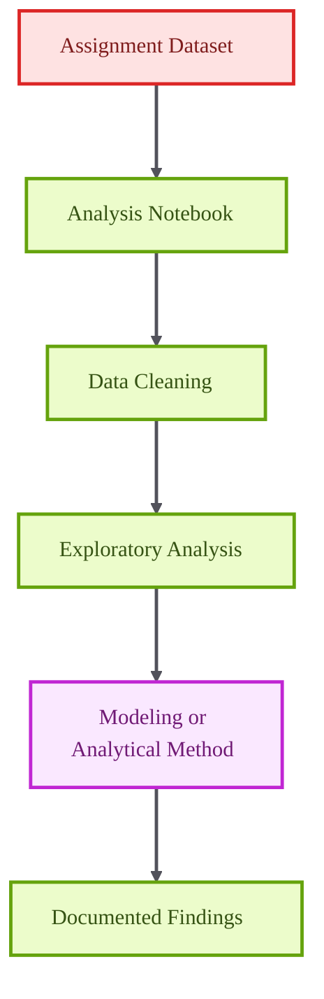

# DAI Assignment 3

<p align="center">

  
  
  
</p>

<p align="center">
  <strong>A structured data-analysis notebook focused on reproducible exploration, modeling, and interpretation.</strong>
</p>

DAI Assignment 3 is documented as a compact analytical project with a notebook-first workflow. The README frames the project professionally so reviewers can understand the objective, execution flow, and expected environment before opening the notebook.

## Core Capabilities

- Captures the full analytical workflow in a Jupyter notebook.
- Supports exploratory data analysis and model-oriented experimentation.
- Provides a clean setup path for reproducible execution.
- Documents the repository for review and portfolio presentation.

## Technical Architecture

The repository uses a single-notebook structure. This is appropriate for assignment-style analysis where the notebook contains the full sequence of loading, exploration, transformation, modeling, and conclusions.

## Architecture Diagram



## Technology Stack

- Jupyter notebook execution.
- Python data-analysis workflow.
- Pandas, NumPy, and visualization-ready environment.
- Extensible structure for adding source data and reports.

## Repository Structure

- `dai-assignment3.ipynb` - Primary analysis notebook.

## Getting Started

```bash
python -m venv .venv
source .venv/bin/activate
pip install pandas numpy matplotlib seaborn scikit-learn jupyter
```

```bash
jupyter notebook dai-assignment3.ipynb
```

## Professional Context

This project demonstrates disciplined notebook organization, data-analysis fundamentals, and reproducible academic project presentation.
